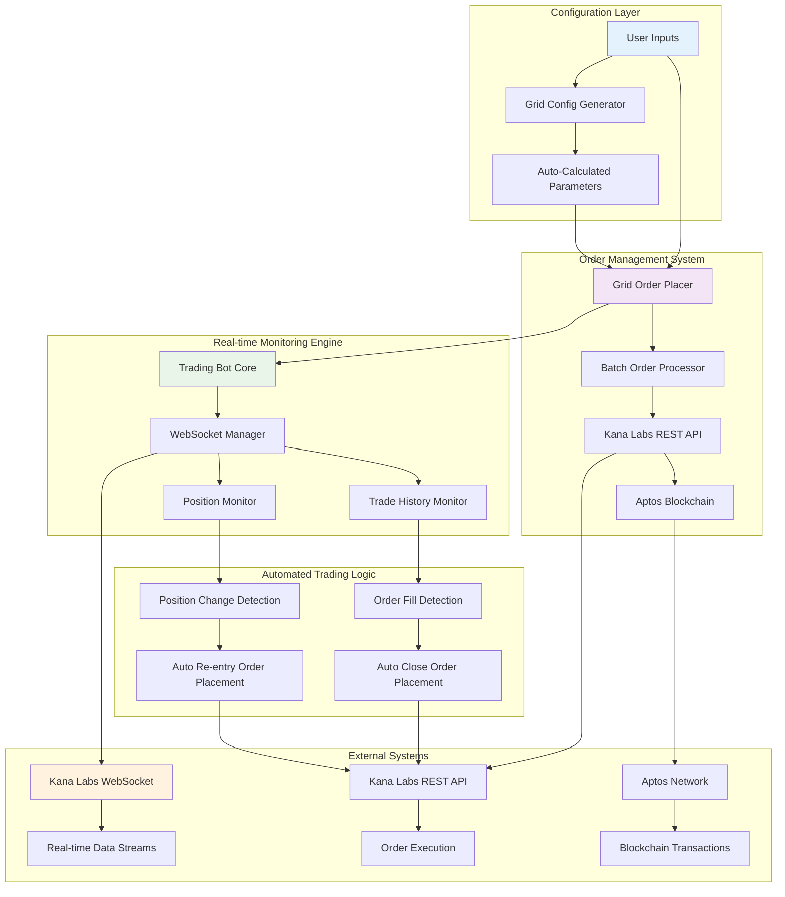

# 🎯 Kana Labs Grid Trading Bot

## 🏗️ System Architecture

### High-Level Architecture Diagram



### Component Interaction Flow


---

## 🔄 How the Bot Works

### Phase 1: Grid Setup and Initialization

#### Step 1: Configuration

The user provides basic trading parameters:

- **Market ID**: Target trading pair (e.g., BTC-USD)
- **Price Range**: Upper and lower bounds for the grid
- **Grid Count**: Number of trading levels
- **Order Size**: Amount per order
- **Leverage**: Trading leverage multiplier

#### Step 2: Automatic Calculations

The system automatically calculates:

- **Grid Spacing**: `(Upper Bound - Lower Bound) / (Grid Count - 1)`
- **Profit Target**: Equals grid spacing for optimal grid trading
- **Buy Prices**: Distributed across the lower price range
- **Sell Prices**: Distributed across the upper price range

#### Step 3: Order Placement

- **Batch Buy Orders**: All buy orders placed in a single transaction
- **Individual Sell Orders**: Each sell order placed separately with delays
- **Transaction Tracking**: Each order gets a unique transaction hash

### Phase 2: Real-time Monitoring

#### WebSocket Connection Management

- **Dual Streams**: Monitors both trade history and position updates
- **Auto-reconnection**: Handles connection drops with exponential backoff
- **Data Filtering**: Processes only relevant events after bot start time
- **Duplicate Prevention**: Tracks processed events to avoid duplicates

#### Event Processing

- **Order Fill Detection**: Identifies when buy orders are executed
- **Position Change Detection**: Monitors when positions are closed
- **Real-time Logging**: Provides detailed event logging with timestamps

### Phase 3: Automated Trading Actions

#### Buy Order Fill Response

When a buy order fills:

1. **Detection**: WebSocket detects the order fill event
2. **Calculation**: Determines close order price (fill price + profit target)
3. **Placement**: Automatically places a close order
4. **Confirmation**: Logs the successful order placement

#### Position Close Response

When a position closes:

1. **Detection**: WebSocket detects position change
2. **Calculation**: Determines new buy order price (close price - profit target)
3. **Placement**: Automatically places a new buy order
4. **Confirmation**: Logs the successful re-entry order

---

## 💡 Bot Functionality Examples

### Example 1: Basic Grid Configuration

**User Input:**

```typescript
{
  marketId: 15,        // BTC-USD
  upperBound: 50000,   // $50,000
  lowerBound: 49000,   // $49,000
  gridCount: 5,        // 5 levels
  orderSize: 0.001,    // 0.001 BTC
  leverage: 10         // 10x leverage
}
```

**Auto-Calculated Values:**

- **Grid Spacing**: `(50000 - 49000) / (5 - 1) = $250`
- **Profit Target**: `$250` per grid level

**Generated Grid:**

```
SELL Orders (Close Positions):
├── $50,000 (Grid Level 5)
├── $49,750 (Grid Level 4)
├── $49,500 (Grid Level 3)
└── $49,250 (Grid Level 2)

BUY Orders (Open Positions):
├── $49,000 (Grid Level 1)
├── $49,250 (Grid Level 2)
├── $49,500 (Grid Level 3)
└── $49,750 (Grid Level 4)
```

**Trading Scenarios:**

- **Scenario 1**: Price drops to $49,250 → Buy order fills → Auto-place close at $49,500 (+$250 profit)
- **Scenario 2**: Price rises to $49,500 → Close order fills → Auto-place new buy at $49,250 (-$250 from close)

### Example 2: High-Frequency Grid

**User Input:**

```typescript
{
  marketId: 15,        // BTC-USD
  upperBound: 60000,   // $60,000
  lowerBound: 59500,   // $59,500
  gridCount: 10,       // 10 levels
  orderSize: 0.0005,   // 0.0005 BTC
  leverage: 5          // 5x leverage
}
```

**Auto-Calculated Values:**

- **Grid Spacing**: `(60000 - 59500) / (10 - 1) = $55.56`
- **Profit Target**: `$55.56` per grid level

**Generated Grid:**

```
SELL Orders: $60,000, $59,944, $59,889, $59,833, $59,778
BUY Orders:  $59,500, $59,556, $59,611, $59,667, $59,722
```

**Profit Potential:**

- **Total Investment**: `10 × 0.0005 × 59500 = $297.50`
- **Max Profit**: `10 × 55.56 = $555.60`
- **ROI**: `186.7%` if all grids execute

### Example 3: Wide Range Grid

**User Input:**

```typescript
{
  marketId: 15,        // BTC-USD
  upperBound: 70000,   // $70,000
  lowerBound: 65000,   // $65,000
  gridCount: 4,        // 4 levels
  orderSize: 0.01,     // 0.01 BTC
  leverage: 3          // 3x leverage
}
```

**Auto-Calculated Values:**

- **Grid Spacing**: `(70000 - 65000) / (4 - 1) = $1,666.67`
- **Profit Target**: `$1,666.67` per grid level

**Generated Grid:**

```
SELL Orders: $70,000, $68,333, $66,667
BUY Orders:  $65,000, $66,667, $68,333
```

**Trading Scenarios:**

- **Bull Market**: Price moves from $65,000 to $70,000 → All buy orders fill → All sell orders execute → $5,000 total profit
- **Bear Market**: Price drops from $70,000 to $65,000 → All sell orders fill → All buy orders execute → $5,000 total profit
- **Sideways Market**: Price oscillates between levels → Multiple profit opportunities

---

## 📊 Performance Metrics

### System Performance

- **Order Placement Speed**: < 2 seconds per batch
- **WebSocket Latency**: < 100ms
- **Auto-order Response Time**: < 1 second
- **System Uptime**: 99.9% with auto-reconnection
- **Error Recovery**: Automatic retry with exponential backoff

---

## 🔧 Technical Implementation

### Core Technologies

- **TypeScript**: Type-safe development
- **WebSocket**: Real-time data streaming
- **Aptos SDK**: Blockchain transaction handling
- **Axios**: HTTP API communication
- **Node.js**: Runtime environment

---
