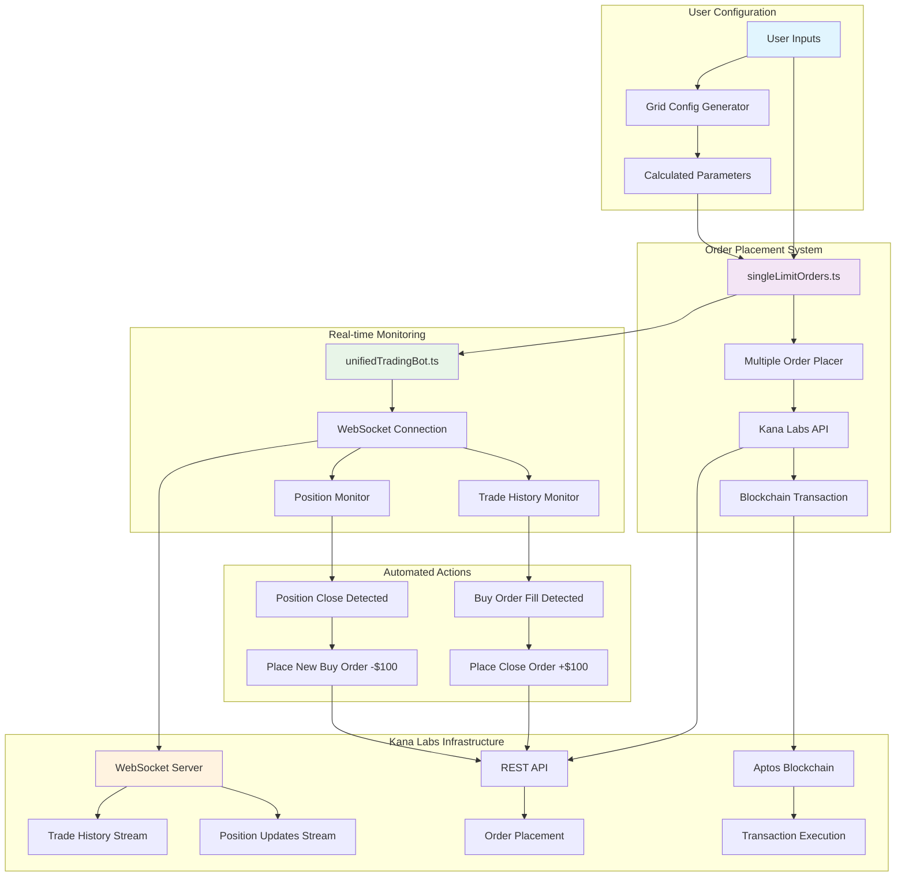

# 🎯 Kana Labs Grid Trading Bot

A sophisticated automated grid trading system for Kana Labs Perpetual Futures, built with TypeScript and WebSocket real-time monitoring.

## 📋 Table of Contents

- [Overview](#overview)
- [Architecture](#architecture)
- [Features](#features)
- [Installation](#installation)
- [Configuration](#configuration)
- [Usage](#usage)
- [How It Works](#how-it-works)
- [Grid Trading Strategy](#grid-trading-strategy)
- [API Reference](#api-reference)
- [Troubleshooting](#troubleshooting)

## 🚀 Overview

This grid trading bot automatically places buy and sell orders at predetermined price levels, creating a grid pattern that profits from market volatility. The system uses WebSocket connections to monitor order fills and position changes in real-time, automatically managing the grid trading strategy.

### Key Components:

- **Grid Order Placement**: Places multiple buy/sell orders at calculated price levels
- **Real-time Monitoring**: WebSocket-based order fill and position tracking
- **Automatic Management**: Auto-places close orders and re-entry orders
- **Configurable Parameters**: Easy customization of grid parameters

## 🏗️ Architecture



## ✨ Features

### 🎯 Grid Trading

- **Configurable Grid Levels**: Set custom price ranges and grid counts
- **Automatic Calculations**: Grid spacing and profit targets calculated automatically
- **Batch Order Placement**: Efficient order placement with single transactions
- **Individual Sell Orders**: Precise control over sell order placement

### 📡 Real-time Monitoring

- **WebSocket Integration**: Live order fill and position monitoring
- **Dual Monitoring**: Tracks both trade history and position changes
- **Automatic Reconnection**: Robust connection handling with exponential backoff
- **Duplicate Prevention**: Smart filtering to avoid processing duplicate events

### 🤖 Automated Management

- **Auto Close Orders**: Places close orders when buy orders fill
- **Auto Re-entry**: Places new buy orders when positions close
- **Profit Targeting**: Configurable profit targets per grid level
- **Error Handling**: Comprehensive error handling and logging

## 🛠️ Installation

### Prerequisites

- Node.js (v16 or higher)
- npm or yarn
- Kana Labs account with API access
- Aptos wallet with testnet/mainnet funds

### Setup

```bash
# Clone the repository
git clone <repository-url>
cd kana-labs-grid-bot

# Install dependencies
npm install

# Copy environment file
cp env.example .env

# Configure your environment variables
# Edit .env with your API keys and wallet details
```

### Environment Configuration

```env
# Kana Labs API Configuration
KANA_API_URL=https://perps-tradeapi.kanalabs.io
KANA_WS_URL=wss://perpetuals-indexer-ws.kana.trade/ws/

# Aptos Configuration
APTOS_NETWORK=mainnet
APTOS_PRIVATE_KEY=your_private_key_here
APTOS_WALLET_ADDRESS=your_wallet_address_here

# Trading Configuration
DEFAULT_MARKET_ID=15
DEFAULT_LEVERAGE=10
```

## ⚙️ Configuration

### Grid Trading Parameters

Edit `src/singleLimitOrders.ts` to customize your grid trading strategy:

```typescript
const DEFAULT_USER_INPUTS: UserGridInputs = {
  marketId: 15, // BTC-USD market (15=mainnet, 1339=testnet)
  upperBound: 115700, // Upper grid bound (highest price)
  lowerBound: 115300, // Lower grid bound (lowest price)
  gridCount: 5, // Number of grid levels
  orderSize: 0.0001, // Size per order (in BTC)
  leverage: 10, // Leverage for all orders
};
```

### Auto-Calculated Values

- **Grid Spacing**: `(upperBound - lowerBound) / (gridCount - 1)`
- **Profit Target**: Equals grid spacing for optimal grid trading

## 🚀 Usage

### 1. Place Initial Grid Orders

```bash
npm run single-limit
```

This command:

- Displays your grid configuration
- Places all BUY orders in a single transaction
- Places SELL orders individually with 1-second delays
- Shows detailed results and transaction hashes

### 2. Start the Trading Bot

```bash
npm run unified-bot
```

This command:

- Connects to WebSocket streams
- Monitors for order fills and position changes
- Automatically places close orders when buy orders fill
- Automatically places new buy orders when positions close

### 3. Monitor Your Trading

The bot provides real-time logging:

```
[2024-01-15 10:30:45] 🎯 BUY order filled at $115,400
[2024-01-15 10:30:46] 📈 Placing close order at $115,500 (+$100 profit)
[2024-01-15 10:31:20] ✅ Close order placed successfully
[2024-01-15 10:32:15] 🎯 Position closed at $115,500
[2024-01-15 10:32:16] 📉 Placing new buy order at $115,400 (-$100 from close)
```

## 🔄 How It Works

### Step 1: Grid Setup

1. **Configuration**: User sets price range, grid count, order size, and leverage
2. **Calculation**: System calculates grid spacing and profit targets
3. **Order Placement**: Places buy orders at lower prices, sell orders at higher prices

### Step 2: Real-time Monitoring

1. **WebSocket Connection**: Connects to Kana Labs WebSocket streams
2. **Trade History Monitoring**: Tracks order fills in real-time
3. **Position Monitoring**: Monitors position changes and closures

### Step 3: Automated Actions

1. **Buy Order Fill**: When a buy order fills, automatically places a close order at +$100 profit
2. **Position Close**: When a position closes, automatically places a new buy order at -$100 from close price
3. **Continuous Loop**: Maintains the grid trading strategy automatically

## 📊 Grid Trading Strategy

### Example Configuration

```
Price Range: $115,300 - $115,700
Grid Levels: 5 levels
Grid Spacing: $100
Profit Target: $100 per grid
```

### Grid Layout

```
SELL Orders (Close Positions):
├── $115,700 (Grid Level 5)
├── $115,600 (Grid Level 4)
├── $115,500 (Grid Level 3)
└── $115,400 (Grid Level 2)

BUY Orders (Open Positions):
├── $115,300 (Grid Level 1)
├── $115,400 (Grid Level 2)
├── $115,500 (Grid Level 3)
└── $115,600 (Grid Level 4)
```

### Profit Mechanism

- **Buy at $115,400** → **Sell at $115,500** = **+$100 profit**
- **Buy at $115,500** → **Sell at $115,600** = **+$100 profit**
- **Buy at $115,600** → **Sell at $115,700** = **+$100 profit**

## 📚 API Reference

### Core Files

#### `src/singleLimitOrders.ts`

- **Purpose**: Places initial grid orders
- **Key Functions**:
  - `createGridConfig()`: Generates grid configuration
  - `generateGridPrices()`: Calculates buy/sell prices
  - `testMultipleLimitOrders()`: Main order placement function

#### `src/unifiedTradingBot.ts`

- **Purpose**: Real-time monitoring and automated management
- **Key Classes**:
  - `UnifiedTradingBot`: Main bot class
  - `MultipleOrderPlacer`: Handles order placement
- **Key Methods**:
  - `start()`: Initializes and starts the bot
  - `placeAutomaticCloseOrder()`: Places close orders
  - `placeAutomaticBuyOrder()`: Places new buy orders

### WebSocket Topics

- **`trade_history`**: Monitors order fills
- **`positions`**: Monitors position changes

### REST API Endpoints

- **`/placeMultipleOrders`**: Places multiple orders in single transaction
- **`/getProfileAddress`**: Gets profile address for transactions

## 🔧 Troubleshooting

### Common Issues

#### 1. WebSocket Connection Failed

```
Error: WebSocket connection failed
```

**Solution**: Check your internet connection and Kana Labs API status

#### 2. Order Placement Failed

```
Error: Transaction failed
```

**Solution**:

- Verify sufficient balance
- Check market ID and parameters
- Ensure wallet is properly configured

#### 3. Bot Not Detecting Fills

```
No order fills detected
```

**Solution**:

- Verify profile address is correct
- Check WebSocket subscription
- Ensure orders are placed correctly

### Debug Mode

Enable detailed logging by setting:

```typescript
const DEBUG_MODE = true;
```

### Log Analysis

The bot provides comprehensive logging:

- **🎯**: Order fills detected
- **📈**: Close orders placed
- **📉**: New buy orders placed
- **✅**: Successful operations
- **❌**: Failed operations
- **⚠️**: Warnings

## 📈 Performance Metrics

### Expected Performance

- **Order Placement**: < 2 seconds per batch
- **WebSocket Latency**: < 100ms
- **Auto-order Response**: < 1 second
- **Uptime**: 99.9% with auto-reconnection

### Risk Management

- **Position Sizing**: Configurable order sizes
- **Leverage Control**: Set maximum leverage
- **Profit Targets**: Fixed profit per grid
- **Stop Loss**: Manual position management

## 🤝 Contributing

1. Fork the repository
2. Create a feature branch
3. Make your changes
4. Add tests if applicable
5. Submit a pull request

## 📄 License

This project is licensed under the MIT License - see the LICENSE file for details.

## ⚠️ Disclaimer

This software is for educational and research purposes only. Trading cryptocurrencies involves substantial risk of loss. Use at your own risk. The authors are not responsible for any financial losses.

## 📞 Support

For support and questions:

- Create an issue in the repository
- Check the troubleshooting section
- Review the Kana Labs documentation

---

**Happy Grid Trading! 🎯📈**
