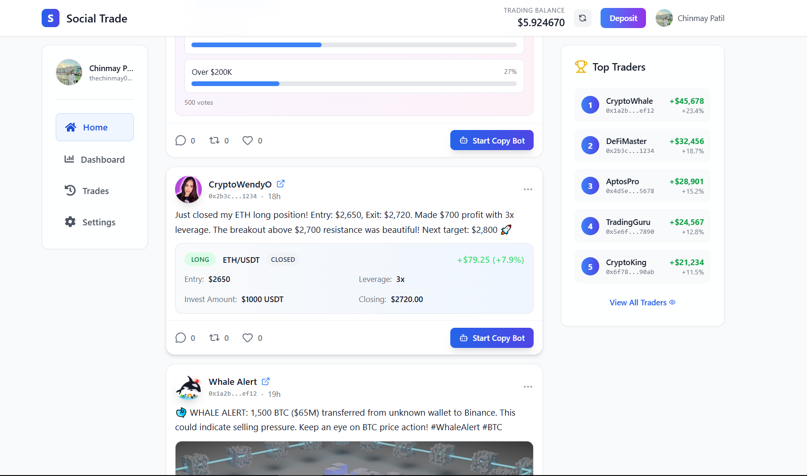

# 🚀 Social Trade - Advanced Copy Trading Platform

> **Real-time social trading platform built on Aptos blockchain with Kana Labs integration**

[](https://www.typescriptlang.org/)
[](https://reactjs.org/)
[](https://nodejs.org/)
[](https://aptoslabs.com/)
[](https://supabase.com/)

## 📋 Table of Contents

- [🎯 Overview](#-overview)
- [🏗️ Architecture](#️-architecture)
- [⚡ Key Features](#-key-features)
- [🛠️ Tech Stack](#️-tech-stack)
- [🚀 Getting Started](#-getting-started)
- [📊 Complete User Journey](#-complete-user-journey)
- [🔧 Configuration](#-configuration)
- [📱 Screenshots](#-screenshots)
- [🔒 Security & Performance](#-security--performance)

## 🎯 Overview

**Social Trade** is a cutting-edge social trading platform that enables users to automatically copy trades from successful traders in real-time. Built on the Aptos blockchain and integrated with Kana Labs perpetual futures, it provides a seamless experience for both traders and followers.

### 🌟 What Makes It Special

- **Real-time Copy Trading**: Automatically replicate trades from top performers
- **Multi-Bot Management**: Handle multiple trading bots simultaneously
- **Social Feed**: Share trades, insights, and market analysis
- **Advanced Analytics**: Comprehensive performance tracking and statistics
- **Gas-Optimized**: Efficient transaction handling with minimal fees
- **Dynamic Bot Management**: Add/remove bots without backend restarts


_Welcome to Social Trade - Your gateway to automated copy trading_

## 🏗️ Architecture

### System Architecture Diagram

```
┌─────────────────┐    ┌─────────────────┐    ┌─────────────────┐
│   Frontend      │    │    Backend      │    │   Blockchain    │
│   (React/TS)    │◄──►│   (Node.js/TS)  │◄──►│   (Aptos)       │
└─────────────────┘    └─────────────────┘    └─────────────────┘
         │                       │                       │
         │                       │                       │
         ▼                       ▼                       ▼
┌─────────────────┐    ┌─────────────────┐    ┌─────────────────┐
│   Supabase      │    │  Kana Labs      │    │   WebSocket     │
│   (Database)    │    │  (Trading API)  │    │   (Real-time)   │
└─────────────────┘    └─────────────────┘    └─────────────────┘
```

### Component Architecture

```
Frontend (React + TypeScript)
├── 📱 Pages
│   ├── Dashboard (Bot Management)
│   ├── Trading Feed (Social Platform)
│   ├── Trades History
│   └── Settings
├── 🧩 Components
│   ├── TradingFeed (Social Posts)
│   ├── Bot Management
│   ├── Balance Display
│   └── Google Auth
└── 🔧 Services
    ├── Bot Management
    ├── Trade History
    ├── Backend Communication
    └── Wallet Integration

Backend (Node.js + TypeScript)
├── 🎯 Core Services
│   ├── Copy Trading Service
│   ├── Order History Service
│   ├── WebSocket Service
│   └── Supabase Service
├── 🔗 Integrations
│   ├── Kana Labs API
│   ├── Aptos Blockchain
│   └── Supabase Database
└── 🚀 Server
    ├── Express.js API
    ├── Health Checks
    └── Dynamic Bot Refresh
```

## ⚡ Key Features

### 🤖 Advanced Copy Trading

- **Real-time Order Detection**: WebSocket-based order monitoring
- **Multi-Bot Support**: Manage unlimited trading bots
- **Exact Copy Trading**: Replicate trades with identical parameters
- **Gas Optimization**: Minimal transaction fees (~0.001 APT per trade)
- **Dynamic Bot Management**: Add/remove bots without system restart

### 📱 Social Trading Platform

- **Trading Feed**: Share and discover trading strategies
- **User Profiles**: Comprehensive trader profiles with performance metrics
- **Interactive Posts**: Like, comment, and follow successful traders
- **Real-time Updates**: Live market data and trade notifications

### 🔧 Technical Excellence

- **TypeScript**: Full type safety across frontend and backend
- **Real-time Communication**: WebSocket integration for live updates
- **Database Optimization**: Efficient queries with proper indexing
- **Error Handling**: Comprehensive error management and logging
- **Environment Configuration**: Flexible deployment configuration

## 🛠️ Tech Stack

### Frontend

- **React 18** - Modern UI framework
- **TypeScript** - Type-safe development
- **Tailwind CSS** - Utility-first styling
- **Vite** - Fast build tool
- **Supabase Client** - Database integration
- **Google OAuth** - Authentication

### Backend

- **Node.js** - Runtime environment
- **TypeScript** - Type-safe development
- **Express.js** - Web framework
- **WebSocket** - Real-time communication
- **Aptos SDK** - Blockchain integration
- **Axios** - HTTP client

### Blockchain & APIs

- **Aptos Blockchain** - Layer 1 blockchain
- **Kana Labs API** - Perpetual futures trading
- **Kana Labs WebSocket** - Real-time order data
- **Supabase** - PostgreSQL database
- **Google OAuth** - User authentication

### Development Tools

- **ESLint** - Code linting
- **Prettier** - Code formatting
- **Git** - Version control
- **pnpm** - Package management

## 🚀 Getting Started

### Prerequisites

- Node.js 18+
- pnpm (recommended) or npm
- Supabase account
- Kana Labs API key
- Aptos wallet

### Installation

1. **Clone the repository**

```bash
git clone https://github.com/yourusername/social-trade.git
cd social-trade
```

2. **Install dependencies**

```bash
# Backend
cd backend
pnpm install

# Frontend
cd ../frontend
pnpm install
```

3. **Environment Setup**

**Backend (.env)**

```env
# Server Configuration
PORT=3001
FRONTEND_URL=http://localhost:5173

# Supabase Configuration
SUPABASE_URL=your_supabase_url
SUPABASE_ANON_KEY=your_supabase_anon_key
SUPABASE_SERVICE_KEY=your_supabase_service_key

# Kana Labs API
KANA_API_KEY=your_kana_api_key
KANA_REST=https://perps-tradeapi.kana.trade
KANA_WS=wss://perpetuals-indexer-ws.kana.trade/ws/

# Aptos Configuration
APTOS_NODE=https://fullnode.mainnet.aptoslabs.com
APTOS_NETWORK=mainnet
MARKET_ID=15

# Gas Wallet (Optional)
GAS_WALLET_PRIVATE_KEY=your_gas_wallet_private_key
```

**Frontend (.env)**

```env
# Supabase Configuration
VITE_SUPABASE_URL=your_supabase_url
VITE_SUPABASE_ANON_KEY=your_supabase_anon_key

# Backend Configuration
VITE_BACKEND_HOST=localhost
VITE_BACKEND_PORT=3001

# Kana Labs API
VITE_KANA_API_KEY=your_kana_api_key
VITE_KANA_BASE_URL=https://perps-tradeapi.kana.trade

# Google OAuth
VITE_GOOGLE_CLIENT_ID=your_google_client_id
```

4. **Database Setup**

```sql
-- Run the SQL scripts in frontend/database/
-- 1. enhanced_bots_table_with_private_key.sql
-- 2. copy_trading_trades_table.sql
```

5. **Start the application**

```bash
# Terminal 1 - Backend
cd backend
pnpm run dev

# Terminal 2 - Frontend
cd frontend
pnpm run dev
```

6. **Access the application**

- Frontend: http://localhost:5173
- Backend API: http://localhost:3001
- Health Check: http://localhost:3001/health


_Platform explorer showing all available features and navigation_

## 📊 Complete User Journey

### Step-by-Step User Flow


### Detailed User Journey

**1. 🚀 User Registration & Setup**

- User visits platform
- Google OAuth authentication
- Profile creation and verification
- Welcome onboarding flow

**2. 💰 Wallet & Funding Setup**

- Automatic wallet generation (Aptos)
- Private key secure storage
- USDT deposit instructions
- 0.1 APT airdrop for gas fees
- Trading balance activation

**3. 📱 Social Trading Discovery**

- Browse trading feed
- View successful traders' posts
- See performance metrics
- Read trading strategies


_Discover successful traders and their strategies in the social trading feed_

**4. 🤖 Copy Bot Creation**

- Click "Start Copy Bot" on any post
- Custom bot naming
- Target wallet confirmation
- Bot activation


_Easy bot creation with custom naming and target wallet confirmation_


_Start copying any trader directly from their posts_

**5. ⚡ Real-time Copy Trading**

- Backend monitors target trader
- WebSocket order detection
- Automatic trade replication
- Transaction confirmation
- Performance tracking


_Track all your copy trades with detailed transaction history and status_

**6. 📊 Management & Analytics**

- Dashboard bot management
- Trade history viewing
- Performance analytics
- Start/stop bot controls


_Comprehensive dashboard for managing all your copy trading bots_


_User settings and profile management with wallet integration_

## 🔧 Configuration

### Environment Variables

| Variable                 | Description          | Required |
| ------------------------ | -------------------- | -------- |
| `PORT`                   | Backend server port  | Yes      |
| `SUPABASE_URL`           | Supabase project URL | Yes      |
| `KANA_API_KEY`           | Kana Labs API key    | Yes      |
| `APTOS_NODE`             | Aptos RPC endpoint   | Yes      |
| `GAS_WALLET_PRIVATE_KEY` | Gas funding wallet   | Optional |

### Database Schema

**copy_trading_bots**

```sql
- id (UUID, Primary Key)
- user_address (Text)
- user_private_key (Text)
- target_address (Text)
- bot_name (Text)
- status (Text: active/paused/stopped)
- created_at (Timestamp)
- updated_at (Timestamp)
```

**copy_trading_trades**

```sql
- id (UUID, Primary Key)
- user_wallet_address (Text)
- bot_id (UUID, Foreign Key)
- symbol (Text)
- market_id (Text)
- action (Text: BUY/SELL/EXIT_LONG/EXIT_SHORT)
- order_type (Text: MARKET/LIMIT/STOP)
- leverage (Integer)
- price (Decimal)
- quantity (Decimal)
- transaction_hash (Text)
- status (Text: SUCCESS/FAILED/PENDING)
- created_at (Timestamp)
```

## 📱 Platform Screenshots

The screenshots above showcase the complete user journey from registration to copy trading, demonstrating the intuitive interface and powerful features of Social Trade.

## 🔒 Security & Performance

**Security Features:**

- Private key secure storage
- Environment-based API configuration
- Input validation and error handling
- CORS protection

**Performance Optimizations:**

- Real-time WebSocket connections
- Optimized database queries
- Gas-efficient transactions (0.001 APT)
- Fast frontend builds

---

**Built with ❤️ by the Social Trade Team**

_Empowering traders through social collaboration and automated copy trading._
